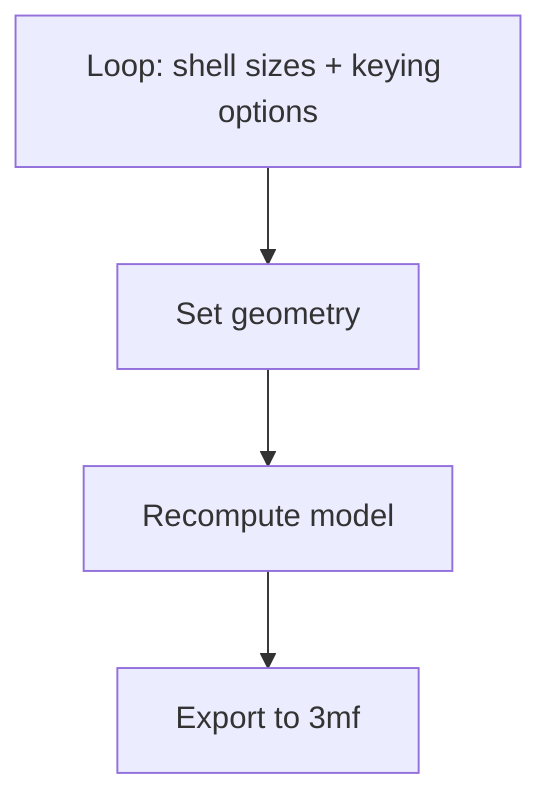
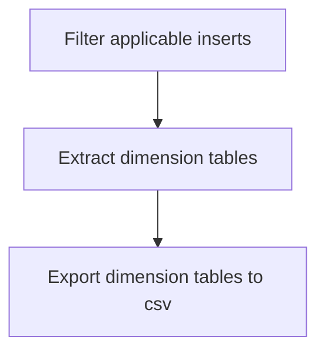



**Circular MIL-DTL-D38999 connectors are electrical connectors for rugged environments. Their design is scoop proof, contains polarization and separated electrical and mechanical connections. Due to high cost, use of these connectors in non-professional environments is low to non-existent. In this project a version of these connectors is developed that uses additive manufacturing and commonly available stamped electrical contacts to achieve a cost below 1€ for the smallest connector system.**

*The D-19 instance of the connector system developed in this project.*

# Introduction 
MIL-DTL-38999 connectors are circular connectors for
rugged environments. They achieve good mechanical locking
and electrical contact by design. Moreover, keys polarize
the connectors preventing wrong connections. The
system is also scoop proof protecting the electrical contacts.
The connectors are based on the MIL-DTL-38999 standard which was first issued in
1999 and has been updated consistently. 

Intensive testing, the materials, and the manufacturing
process make these connectors expensive (60€ or more for one
connector). Thus, this connector system has been used
exclusively in applications where requirements rule out
alternatives. The benefits of the connectors can, however,
be useful in other fields as well. For example the different
keying options can prevent equipment being connected wrongly
while keeping the connection system unified. This gives the
advantage of not needing to remember the mating procedures
for different connector systems. 

In order to make these connectors available the cost has to
be lowered significantly. A design that reduces costs is
developed in this project. The goal is **not** to make fully
MIL-DTL-38999 rated connectors with the same resilience against
water ingress and hostile environments, but to transfer the
remaining advantages of the system to a low cost alternative.  

The results of this project are available on [printables](https://www.printables.com/@leandermerbe_4394823/collections/3171811). The project sources and more detailed documentation of the design process is available on [github](https://github.com/LMerbecks/D38999-3MF).

# Motivation

This project is motivated most by my personal experience
with the D38999 connector system. During my master thesis I
did a deep dive to explore the possibilities of using these
connectors in a power distribution system in an aircraft.
While these connectors were not used in the end, I gained
extensive knowledge on them in the process. To preserve this
knowledge in something useful I started this project. 

Apart from that the advantages of the D38999 
- separated mechanical and electrical connection system,
- polarization, 
- customizability through inserts, and
- ease of mating

are useful even if the system cannot withstand harsh environments. Thus, a simpler version
of these connectors can make these connectors with their
advantages available for
projects on a tight budget, for example hobbyists. 

In a nutshell, this project serves to preserve personal
knowledge in a product that provides value for the maker community.

# State of the Art 
The MIL-DTL-38999 connector system are the base of the models developed in this project.
The different elements of the system are briefly explained. 

The connector systems are always made up of
shells and inserts. The shells are the mechanical part of
the connector. They provide the structure and the mechanical
mating interface. On the other hand, the inserts are
responsible for the electrical interface. They localize the
electrical contacts in the shell. 

The shell geometry for different sizes is defined in
MIL-DTL-38999. The standard defines the type III series,
which is the base series in this project, to use a triple
thread for mechanical mating. Additionally, keys and keyways
are used to polarize the connectors and prevent wrong
connections. Most of the dimensions in the geometry of the
shells is standardized. 

Overall, 9 shell sizes are defined in the standard. The
shell sizes are encoded in a military and a civil code. The
following table lists both codes in increasing order. 

*Military and civil shell size codes.*

| Military Shell Size Code | Civil Shell Size Code |
| ------------------------ | -------------------| 
| A | 9 |
| B | 11 |
| C | 13 |
| D | 15 |
| E | 17 |
| F | 19 |
| G | 21 |
| H | 23 |
| J | 25 |

Every shell is, furthermore, available in six different
keying options listed in the following table.

*Shell keying options.*

| Number | Keying Option Code |
| --- | ---- |
| 1 | N |
| 2 | A |
| 3 | B |
| 4 | C |
| 5 | D |
| 6 | E |

Receptacles and plugs are the main types of shells. Receptacle geometries are (most of the time) considered the stationary part of the connector system. The mounting styles range from bolted to walls or bulkheads to clamped with jam nuts. The plugs are the components that can move freely. In other words the plugs are located at the end of cables. Straight plugs and right angle plugs make up the majority of connections for this type of shell. In general, plugs are used with socket inserts and receptacles with pin inserts. This keeps the more exposed pin contacts at the stationary part of the connector system. 

The inserts for the D38999 connector system are defined in
MIL-STD-1560. In general the inserts are divided into pin and socket inserts. Each type is designed to accept and locate contacts of the respective gender. The layout of the contacts in an insert is called insert arrangement. There are over 100 different arrangements
available with different contact sizes and number of
contacts. Inserts are moreover characterized by the shell
sizes they fit into. There are at least five inserts defined
for every shell size. 

As any shell size can use any insert that fits the size and
have one of six different keying options there are many
configuration options available in the D38999 connector
system. A conservative number based on the nine shell sizes,
the six keying options and at least five inserts per shell
is 
$$9 \cdot 6 \cdot 5 = 270.$$

Apart from the geometry the standard defines materials used for the shells and inserts. Moreover, coatings are specified. These can be problematic as they use hazardous materials. They do achieve excellent resilience against corrosion, though. 

# Design Methods 

From the standard explained previously a derived connector system is designed. The design of that connector system can be split into two main parts as can the original connector
system: 
1. shell design, and
2. insert design. 

In the shell design the mechanical interface is developed.
The insert design contains the electrical design. 

Because of the large number of configuration options the
design is performed with parametric CAD models. These models
allow rapid switching between configurations. The open source and free CAD program [FreeCAD](https://freecad.org) is used in this project. Furthermore,
scripting is used to automate the generation of models for
speed and reliability. All design procedures are performed
with additive manufacturing as manufacturing method in mind.
This manufacturing method is chosen because the low cost and
high design freedom. 

## Mechanical Design 

The shells make up the mechanical part of the connector
system. They are mostly based on the dimensions of the
original standard with only minor adaptations. The two
shell geometries developed are 
1. wall mount receptacle, and
2. straight plug.

Alternate geometries like the jam nut receptacle or right-angle plug were omitted to limit the scope of this project. The following figure shows the geometries developed in this project. 

*Shell geometries developed in this project. Plug on the right and shell on the left.*

Where necessary the geometry is adapted to tailor it towards
additive manufacturing. The first change is the design of
the straight plug as print-in-place part. The straight plug
normally consists of a core part and a coupling nut that
need to be assembled. The first design iteration in this project also used this approach as visualized in the following figure. 

*Early version of plug shell with separate coupling nut (left) and core (right).*

The design change adapts the geometry
such that the two parts are printed in place and need not be
assembled. For this a wedge joint is used. The tolerance of this joint is determined through tests. The 

Another change is the increase in tolerance on the threads.
This gives more room for deviating dimensions during the
manufacturing process. Deviations stem mainly from the
overhanging geometry in the trapezoidal thread profile. The change was integrated after an investigation with cut away models showed the threads were a major cause of jamming during mating. The following picture shows these cut away models of the shells. 

*Cutaway model of shells for thread interference investigation*

The last change highlighted in this report is the
interface for the inserts. In the original standard the
inserts are made from elastic material. Assembly into the
shell is performed by retaining rings in the shell geometry. For
the AM version a D shaped hub is used. This allows for
accurate positioning of the insert in the shell without the
need for overhangs in the geometry. The insert interface is
identical on both the receptacle and the plug. Therefore,
any insert can be inserted in either shell type. 

All geometry is modeled with FreeCAD and parametrized.
Parameters control the shell size and the keying option of
the geometry. This also enables automated export of the
geometries into 3mf format files by python scripts. A simplified flow
chart of the export script is shown below. 

*Flowchart of automated shell export*

## Electrical Design

In the electrical design the electrical interface of the
connector system is designed. This includes the contacts on
the one hand and the inserts as fixture for the contacts on
the other hand. 

The original standard uses turned circular pin and
socket crimp contacts for the electrical connection. This makes
the contacts strong but also expensive. Cheaper electrical
contacts are made from stamped sheet metal. I took
inspiration in the context of electrical contacts from [this
Thing](https://www.thingiverse.com/thing:3129731) made by [fdavis](https://www.thingiverse.com/fdavies/designs). This creator used [Molex 1560](https://www.molex.com/en-us/products/series-chart/1560)
and [1561](https://www.molex.com/en-us/products/series-chart/1561) stamped pin and socket crimp contacts. These
contacts are COTS parts, cheap and readily available. Their cost varies a bit depending on the surface finish. Tinned brass contacts cost approximately 0.13€ on [mouser](https://www.mouser.de/ProductDetail/Molex/02-06-1103?qs=359VwiUTsp0rVi3UDduwvw%3D%3D).

To localize the contacts in the shell, inserts are used. The
insert geometry is derived mainly from the standard.
However, adaptations ensure the insert can mate with the
custom shells described earlier. These main adaption is the integration of a D profile at the interface to the shell.

The contacts are press fitted into the inserts. To arrive at
a fixture geometry that yields sufficient grip for mating
and disconnecting a test with 25 geometries is performed for
both genders.
Subsequently, the best fitting geometry is used for all
contacts. The test fixture is shown below. 

*Models for testing fixture geometries for contacts*

Because of the large amount of inserts available in
MIL-STD-1560, the generation of the inserts is fully
automated. The automation contains two main steps. The
flowchart below shows the program workflow as implemented in
python. 

*Flowchart of automatic insert arrangement dimension extraction*

Early tests with manually created inserts show
that the Molex 1560/1561 contacts have roughly the same size
as the size 20 contacts of the original contacts. 

With this information the standard content is filtered for
inserts containing only size 20 or greater contacts. This
ensures the insert geometry can be used. From the filtered
results, dimension tables are created that contain the x and
y position of all contacts on the front face of the pin
insert. The position of the contacts on the front face of
the socket insert is mirrored along the y-axis. 

This first step of the automation yields 56 applicable
inserts that work with the Molex 1560/1561 contacts. 

From the dimension tables the geometry of these inserts is
then created via the FreeCAD CLI.
The four step operation is illustrated in the following
picture. First an insert dummy without holes for the contacts is created. Next a tool body for the contact is created. Afterward, this tool body is moved to the correct position. Finally the tool body is subtracted from the insert dummy. This operation is repeated for all contact positions. 

*Four step process of generating insert geometry. Repeated for all contact positions.*

In the end 56 insert arrangements in both genders are
created and the geometry exported as `.3mf` file. The
following figure shows the resulting geometry of one insert. 

*Resulting geometry for 15-19P insert.*

# Results 

With PLA as printer material the cost of a connector are
below 1€. In the following table the cost of a contact is assumed to be at 0.13€ per contact. The base for this cost is this [tinned 1561 contact offer](https://www.mouser.de/ProductDetail/Molex/02-06-1103?qs=359VwiUTsp0rVi3UDduwvw%3D%3D). The cost for contacts do not scale linearly, so this is a worst case. The table only lists a selection of all possible connector systems. 

*Table with costs of selected connector systems.*

| Connector System | Printed Components Cost (20€ / kg PLA) / € | Contacts Cost (0.13€ per piece) / € | Total Cost / € |
| ----- | ----- | ------ | ------ |
| A-3 | 0.23 | 0.78 | 1.01 |
| B-99 | 0.29 | 1.72 | 2.01 | 
| C-98 | 0.41 | 2.60 | 3.01 |
| D-19 | 0.49 | 3.64 | 4.13 | 
| E-26 | 0.58 | 6.76 | 7.34 |

This data is visualized in the following bar chart. Observe, that the contacts make up a large portion of the cost. Note, however, that the contacts cost falls approximately 50% when they are ordered in bulk. 

*Bar chart visualizing cost contributions for five connector systems.*

The total amount of options for connectors designed in this
project is 330. The following table illustrates the
calculations to arrive at these.

*Table listing options available.*

| Shell size | No of Insert Arrangements | Total Options Including 6 Keying Options |
| --- | --- | --- |
| A | 2 | 12 |
| B | 5 | 30 |
| C | 3 | 18 |
| D | 5 | 30 |
| E | 4 | 24 |
| F | 4 | 24 | 
| G | 9 | 54 |
| H | 7 | 42 |
| J | 16 | 96 |
| **Total** | - | **330** |

The normal keying options of these connectors are published
and available for download on [printables](https://www.printables.com/@leandermerbe_4394823/collections/3171811). The print
times can reach multiple hours. 

To assemble the connectors four steps are necessary. First
the inserts must be redrilled with a 2mm drill. This step
may be skipped if the print quality is sufficient. Next the
contacts need to be crimped onto the wires. They can be
pushed into the insert with needle nose pliers after this.
Last the inserts may be installed in the separately printed
shells. It is recommended to use glue (CA glue) here to
ensure the insert stays in the shell. A decent friction fit
could not be achieved in this project, due to variable print
performance depending on shell size. The assembly process is shown in the following figure. 

*Assembly process of connector system.*

# Conclusion

Because the connectors can be manufactured for as low as 1.01
€ per piece the goal to reach a competitive price has been
reached for all connectors. The design was made available
for makers or hobbyists using [printables](https://www.printables.com/@leandermerbe_4394823/collections/3171811). A version history and all source files are available on [github](https://github.com/LMerbecks/D38999-3MF). For assembly
minimal tooling is necessary. The project is thus considered
finished. A remaining bottle neck is the time needed for
publishing of all models. With an estimated time of 5
minutes per model, publishing all models would take
approximately 24h. 

# Outlook

This project could develop other shell types as well. An
example are the jam nut receptacles. For this shell type a
preliminary design exists in this project. The design was
discontinued at the start of the project, however, because there were clearance issues between the jam nut thread and the main mating thread. Moreover, the jam nut uses a very fine thread that is hard to additively manufacture. 

Another work item, mentioned previously, is the publication
of all connector options. This is primarily a time intensive
task. 

Further development could make the inserts clip into place
in the shells. Glue would then not be necessary for assembly
of the connectors. 

Moreover, the integration of a ratchet mechanism in the
coupling nut is another opportunity for development. This
feature is present in the original standard and can prevent
loosening of the connectors in vibration environments. 

A last development opportunity is the design of inserts that
accept different electrical contacts. With this, the
connector system can be expanded to be able to handle higher
currents. 